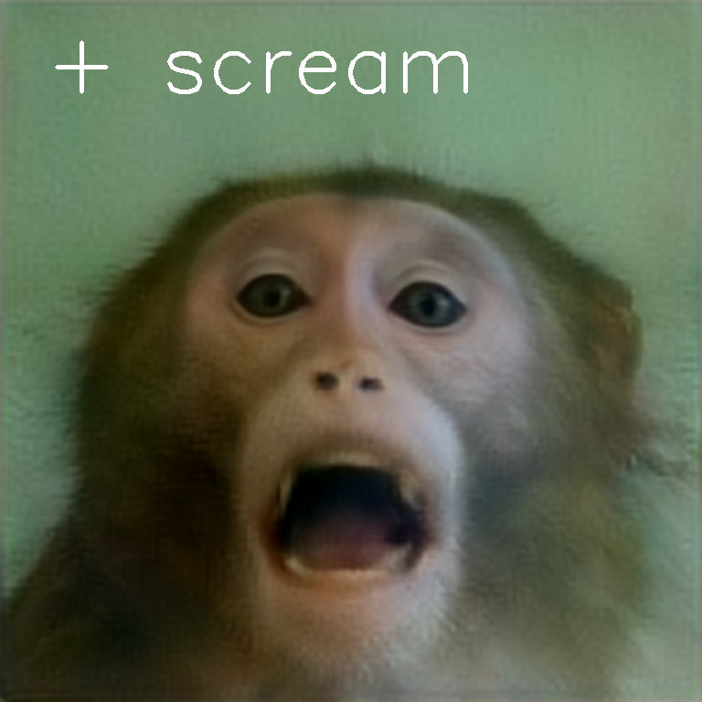

# Motion transfer-enhanced StyleGAN for generating diverse macaque facial expressions

> In this study, we developed StyleGAN2 model for macaque monkeys, which are widely studied in systems neuroscience and evolutionary research, and proposed a method for generating their facial expressions. Since, facial expressions are largely consistent across individuals due to the similar musculoskeletal structures and their role in social communication, we address the limitation of lack of available data by introducing a data augmentation approach. We used a motion transfer technique and refined the training procedures, which consisted of three steps: 1) data augmentation by synthesizing new facial expression images using a motion transfer technique to animate still images via computer graphic animations, 2) selection of image samples based on the latent representation of macaque faces from the initially trained StyleGAN2 model to ensure the variation and uniform sampling in training dataset, and 3) refinement of the loss function to ensure the accurate reproduction of subtle movements, such as eye movements. We demonstrated that the model trained using our method can generate a wider variety of facial expressions for multiple macaque individuals compared to a model trained solely on original still images without motion-transfer-based data augmentation. We also showed that our model is effective for style-base image editing and revealed that specific style parameters correspond to particular facial movements, highlighting its potential to identify individual action components as sets of disentangled style parameters.

<!-- <a href="https://doi.org/10.1016/j.chb.2023.107811"></a> -->


## Inversion and Style mixing
### Mixing results

First row/column: Source images. Second row/column: Inverted images.<br>
Images in the first column were synthesized for the motions which is described in our paper.

- Injection of 0,1,2 layers from column images to row images (Mouth movements)

- Injection of 6,7,8 layers from column images to row images (Eye movements)

- Morph (50% blending in all layers) (Intermediate identity)


### Use your own source images

```bash
bash scripts/demo_mixing.sh
```

## Editing

We offer editing direction for facial expression _bark_, _blink_, _brow raise_, _chewing_, _coo_, _lip smack_, _scream_, _threat_, _tongue protrude_, _yawn_ from [MF3D](https://github.com/Phenomenal-Cat/MF3D-Tools "MF3D"). We also offer additional facial motion from our original video for _look-up_, _look-down_, _look-left_, _look-right_, _tongue show_ and annotated directions for _species_, _age_, and _sex_, and _head orientation_.

For the quality of face editing, please refer to our paper.


### Use your own source images

We provide a simple editing software which enable to interactively edit the predefined facial properties. Key typing correspoints to manipulate motions along the editing directions.

In the following bash file, you shoud specify an image path (```path_img```), a checkpoint path of the restyle-encoder (```checkpoint_path```), and a pool directory of the editing directions (```dir_directions```).

The prepared checkpoint at ```data/checkpoints/``` is trained with the motion transfer-based augmentation and the L2 loss for eye.

```bash
bash scripts/demo_editing.sh
```

<p align="center">
  
</p>

## Citation
If you use this code for your research, please cite the following work:

```
@article{igaue***mfgan,
  author={Igaue, Takuya and Correia-Caeiro, Catia and Yoshida, Akito and Miyabe-Nishiwaki, Takako and Hayashi, Ryusuke},
  title={Motion transfer-enhanced StyleGAN for generating diverse macaque facial expressions},
  journal = {***},
  year = {***}
}
```

## Acknowledgments
Our facial motions include ones from [MF3D](https://github.com/Phenomenal-Cat/MF3D-Tools "MF3D").
For the motion transfer, we used [TPSMM](https://github.com/yoyo-nb/Thin-Plate-Spline-Motion-Model "TPSMM") for motion synthesis.
For the image generation, our method is based on [StyleGAN2-ADA](https://github.com/NVlabs/stylegan2-ada "StyleGAN2-ADA")
and [ReStyle](https://github.com/yuval-alaluf/restyle-encoder "ReStyle"). For the image editing, our method is based on [InterfaceGAN](https://github.com/genforce/interfacegan "InterfaceGAN") and [StyleSpace-pytorch](https://github.com/xrenaa/StyleSpace-pytorch "StyleSpace-pytorch"). We used [InsightFace](https://github.com/deepinsight/insightface "InsightFace") for the face detection.
